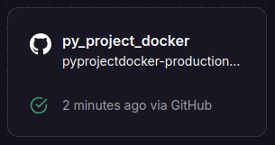
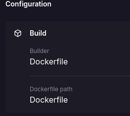
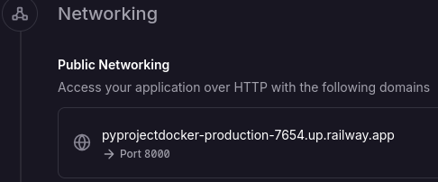

# Hello world with python

## Results
<p align="center">
    
</p>

## :open_book: How to use
### Pre-requisites
   * python
   * pip
   * Code editor
---
* Clone repository
    ```
    git clone
    ```
* Open the program in a code editor of your choice
* Position yourself at the root of the project from the terminal of your code editor
* Run the command:
    ```
    pip install requirements.txt

    uvicorn app:app --reload
    ```
* Visit your computer's `localhost` port `8000`
> [!TIP]
> Verify that the selected port is deprecated

## :rocket: How to run with docker
### Pre-requisites
* Docker - DockerDesktop installed
* DockerHub account
---
Visit the following link to learn about the process of generating the project image

:whale2: [GO](https://hub.docker.com/repository/docker/pamendeza/python_docker_project "Docker steps")

## :light_rail: PAAS Deploy(Railway)
For its deployment in a PAAS we will rely on railway and its easy implementation thanks to its container management. 



The platform automatically uses our Dockerfile to build the container. 



> [!IMPORTANT]
> Generate the domain for the application specifically with port 8000 because it is the one that uvicorn is running within docker



:snake:[Hello World](https://pyprojectdocker-production-7654.up.railway.app "click for visit")