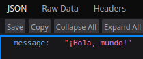

# Hello world with python

## Results
<p align="center">
    
</p>

## :open_book: How to use
* Clone repository
    ```
    git clone
    ```
* Open the program in a code editor of your choice
* Position yourself at the root of the project from the terminal of your code editor
* Run the command:
    ```
    uvicorn app:app --reload
    ```
* Visit your computer's `localhost` port `8000`
> [!TIP]
> Verify that the selected port is deprecated

## :rocket: How to run with docker
Visit the following link to learn about the process of generating the project image

:whale2: [GO](https://hub.docker.com/repository/docker/pamendeza/python_docker_project "Docker steps")

## :light_rail: PAAS Deploy (Railway)
